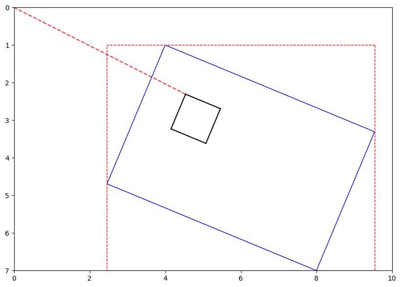

# Painted Turtle

Painted Turtle is a pen-plotter interaction library that targets complex, object-oriented models of the world. It is designed to be used with the [AxiDraw V3](https://www.axidraw.com/) pen plotter, but can be adapted to other pen plotters as well.

## Design Philosophy

In general, the `pt` library comprises `PTObject`s which represent physical resources available to a pen plotter in the studio space. These object might include an inkwell, a canvas, a water basin, paint palette, etc. Each `PTObject` can choose its own verbs, which are then exposed to the top-level `Studio`. In this way, the artist can write high level commands (e.g, `rinse_brush()` or `load_paint("blue")`) and the `Studio` will delegate the work and generate the underlying low-level (e.g., `move_to` or `pen_down`) commands.

## Installation

```bash
git clone https://github.com/j6k4m8/painted-turtle.git
cd painted-turtle
uv sync
uv pip install https://cdn.evilmadscientist.com/dl/ad/public/AxiDraw_API.zip
```

## Example

```python
from pt import Studio, Canvas, PTObject, MPLMockPlotter

plotter = MPLMockPlotter()
studio = Studio(plotter)
# Put a postcard into the middle of the stage, kinda all at a weird angle...
studio.add_object(Canvas(Vec2(6, 4), Vec2(4, 1), Vec2(4 + 4, 1 + 6)), name="canvas")

# Draw a square on the canvas
studio.canvas_draw_line(Vec2(1, 1), Vec2(2, 1))
studio.canvas_draw_line(Vec2(2, 1), Vec2(2, 2))
studio.canvas_draw_line(Vec2(2, 2), Vec2(1, 2))
studio.canvas_draw_line(Vec2(1, 2), Vec2(1, 1))

# Reset
studio.plotter.pen_up()
studio.plotter.move_to(Vec2(0, 0))

# Draw the path of the pen for debugging:
studio.debug_draw()
```



## Fiducials Script

You can use the `fiducials` script to identify the coordinates of real-world objects in the canvas space.

For more information, see the [Fiducials](docs/fiducials.md) documentation.

```bash
uv run fiducials --help
```

## Roadmap

-   [x] Implement `PTObject` and `Studio` classes
-   [x] Implement `MPLMockPlotter` for testing without a physical plotter
-   [x] Implement `AxiDrawPlotter` for interfacing with the AxiDraw V3
-   [x] `Canvas` with local-coordinate-frame transformations to global coordinates (so you can draw on a canvas at any angle or position using intuitive coordinates to the canvas itself)
-   [ ] Watercolor painting
    -   [ ] `WatercolorCanvas`
    -   [ ] `WatercolorPalette`
    -   [ ] `WatercolorBasin`
-   [ ] Pen-switching with a multi-pen setup
    -   [ ] alignment calibration

## The Name

Painted turtles are a species of turtle native to North America. They are known for their colorful shells and are often found basking in the sun on logs or rocks.

Turtle graphics is a term in computer graphics that refers to a programming style that allows the user to control a "turtle" that can move around the screen and draw lines. It is quite similar to the way a pen plotter works.

Painting is when you use a brush or pen to apply pigment to a surface.

So like. Painted Turtle. Get it? 🎨🐢

```

```
